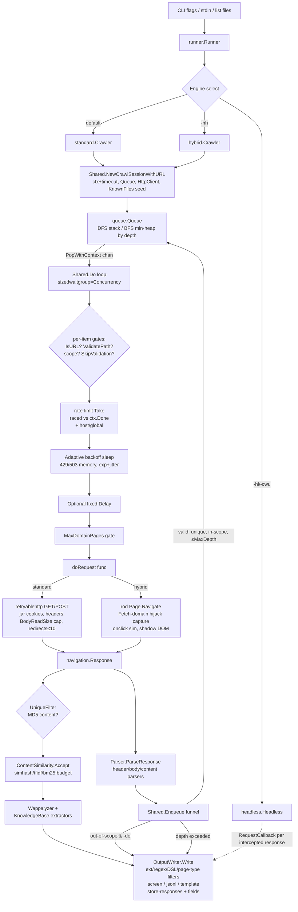

# KATANA ARCHITECTURE CORPUS

**Target:** `github.com/projectdiscovery/katana` (Go 1.26)
**Scope of analysis:** full source inspection of `cmd/`, `internal/`, `pkg/`, and `go.mod` in `/Users/macbook/Developer/katana`
**Purpose:** single source of truth for understanding, extending, and porting Katana to Rust with 1:1 feature parity.

> Every claim below is anchored to an actual source file/function. When a behavior is version-sensitive it is described as implemented in this working tree.

---

# SECTION 1 — System Overview & Dependency Matrix

## 1.1 Core Purpose & Threat Modeling

Katana is a **recursive web crawler built for offensive-security automation pipelines**. It sits at the discovery layer of the ProjectDiscovery recon chain (`subfinder → httpx → katana → nuclei`):

- **Input surface:** CLI URLs/URL-list files, stdin streams, or the Go library API (`types.Options{OnResult: ...}` consumed as a library).
- **Primary mission:** enumerate *attack surface* — endpoints, parameters, forms, JS-referenced API routes, XHR/fetch traffic, hidden DOM interactions — not to exploit anything itself.
- **Two execution models:**
  - **Standard engine** (`pkg/engine/standard`): pure HTTP fetch + static parsing. Cheap, massively parallel, no JS execution.
  - **Headless engines** (`pkg/engine/hybrid`, `pkg/engine/headless`): drive a real Chromium via CDP. Hybrid = browser renders pages but parsing still happens Go-side through network hijacking; Headless = a state-graph crawler that clicks buttons, fills forms, tracks SPA page states, solves CAPTCHAs, and auto-logs-in.
- **Threat model assumptions:** Katana runs from the attacker's vantage point with unauthenticated (optionally credentialed) access; it must survive hostile targets that serve redirect loops, mega-pages (>2 MB URLs), honeypot content farms (similarity filtering), rate limiters (adaptive backoff), bot detectors (TLS impersonation, stealth JS), and cookie-consent walls.
- **Safety rails relevant for porting:** scope enforcement (`pkg/utils/scope`), egress policy (`networkpolicy` deny lists for private IPs/CIDR/ASN/ports), logout-link avoidance when credentials are supplied, opt-in secret validation (`-kb-validate-secrets`) because live validation calls the credential provider.

## 1.2 `go.mod` Deep Dive

Module: `github.com/projectdiscovery/katana`, `go 1.26`. Direct requires (grouped by function):

### Networking & HTTP
| Dependency | Version | Role |
|---|---|---|
| `github.com/projectdiscovery/retryablehttp-go` | v1.3.21 | All standard-engine HTTP I/O. Wraps `net/http` with retry/backoff policies (`HostSprayRetryPolicy()` used at `pkg/engine/common/http.go:73`), request dumping (`req.Dump()`). |
| `github.com/projectdiscovery/fastdialer` | v0.5.16 | Custom dialer: DNS resolution w/ custom resolvers, connection pooling, and **JA3 TLS impersonation** (`fastdialer/ja3/impersonate.Random`) wired into `Transport.DialTLSContext` (`pkg/engine/common/http.go:29-34`). |
| `github.com/refraction-networking/utls` | v1.8.2 (indirect) | Underlies fastdialer impersonation — uTLS ClientHello randomization. |
| `github.com/Mzack9999/go-http-digest-auth-client` | (indirect) | Digest auth support pulled in via retryablehttp. |
| `golang.org/x/net` | v0.57.0 | `publicsuffix` (eTLD+1 scope math in `pkg/utils/scope/scope.go:170`), `html` parser (`x/net/html` used by goquery + doctype parsing in `pkg/engine/parser/parser.go:509`). |
| `github.com/projectdiscovery/networkpolicy` | v0.1.45 | Egress deny-listing (private IP ranges, CIDR, ASN-expanded ranges, ports) validated per input in `internal/runner/executer.go:39`. |

### Browser Automation & CDP
| Dependency | Role |
|---|---|
| `github.com/go-rod/rod` v0.116.2 | The only browser stack. Used directly by `hybrid` (`launcher`, `cdp.WebSocket`, `proto.*` Fetch/Page/DOM/Network domains) and by `headless/browser` (`rod.Pool[BrowserPage]`, `proto.TargetCreateBrowserContext`, `EachEvent`). No chromedp anywhere despite common misconception. |
| `github.com/ysmood/leakless`, `got`, `gson`, `goob`, `fetchup` | rod's process-supervision, JSON-value, event-bus and download helpers. |
| `github.com/projectdiscovery/utils/chromeshell` | Downloads/pins `chrome-headless-shell` binary when headless (`buildChromeLauncher`, `chromeshell.Ensure()`). |

### Parsing, AST & Content Analysis
| Dependency | Role |
|---|---|
| `github.com/PuerkitoBio/goquery` (+ `andybalholm/cascadia`) | CSS-selector DOM queries over every response (`resp.Reader *goquery.Document`). ~28 body parsers select on tag/attribute combos. |
| `github.com/lukasbob/srcset` | `` / `source[srcset]` multi-URL parsing (`utils.ParseSRCSetTag`). |
| `github.com/Mzack9999/jsluice` | Go binding of BishopFox/TomNomNom jsluice — Tree-sitter-JS AST URL extraction (`pkg/utils/jsluice.go:35`). Build-tagged out on 386/windows (`parser_nojs.go`). |
| `github.com/odvcencio/gotreesitter` | (indirect) tree-sitter runtime backing jsluice's JS grammar. |
| `github.com/ditashi/jsbeautifier-go` | (indirect) JS beautification before regex scraping. |
| `github.com/mfonda/simhash` | Legacy simhash dep; the active implementations are in-tree (`pkg/similarity/simhash.go`, `headless/crawler/normalizer/simhash`). |
| `github.com/happyhackingspace/dit` | Page-type classifier ("login", "error", "captcha", "parked", …) powering `-knowledge-base`, `-filter-page-type`, auto-login form detection, and form classification. |
| `github.com/praetorian-inc/titus` | Secret detection engine behind `-kb-secrets` (`pkg/knowledgebase/extractors/secrets/secrets.go`). Uses `flier/gohs` (Hyperscan FFI) internally. |
| `github.com/cloudflare/ahocorasick`, `dlclark/regexp2`, `brianvoe/gofakeit/v7` | (indirect) pattern matching + faker values for form fill DSL. |
| `microcosm-cc/bluemonday`, `aymerick/douceur`, `gorilla/css`, `yuin/goldmark` | (indirect) sanitization/markdown used transitively by dit/glamour. |

### Concurrency, Queue, Storage & State
| Dependency | Role |
|---|---|
| stdlib `sync`, `sync/atomic`, `container/heap` | `Shared.DomainPageCounter sync.Map`, atomic result counters, BFS priority heap (`pkg/utils/queue/priority_queue.go`). |
| `github.com/remeh/sizedwaitgroup` | Bounded worker pools: input parallelism (`executer.go:37`) and crawl concurrency (`common/base.go:406`). |
| `github.com/adrianbrad/queue` | Generic FIFO (`queue.NewLinked`) used for headless **action queue** (`crawler.Crawler.crawlQueue`). |
| `github.com/hashicorp/golang-lru/v2` | LRU caches: per-host backoff table (`hostBackoffsCacheSize=10000`), per-host PathTrie roots (`DefaultMaxHosts=10000`). |
| `github.com/projectdiscovery/hmap` | Disk-backed hybrid hashmap — the dedup store for URLs and MD5(content) keys (`pkg/utils/filters/simple.go`). |
| `github.com/projectdiscovery/ratelimit` | Token bucket global limiter + `AutoLimiter` keyed per host. |
| `github.com/projectdiscovery/fastdialer`, `retryabledns`, `miekg/dns` | Resolution path. |
| `tidwall/buntdb`, `syndtr/goleveldb`, `akrylysov/pogreb`, `go.etcd.io/bbolt` | (indirect) storage engines under hmap/utils. |
| `github.com/dominikbraun/graph` | Directed graph library for the headless **crawl state graph** (`ShortestPath`, DOT export). |

### CLI, Output & Utilities
| Dependency | Role |
|---|---|
| `github.com/projectdiscovery/goflags` | Flag parsing + config-file merge + resume config serialization; enum var for `-known-files`. |
| `github.com/projectdiscovery/gologger` (+ `lmittmann/tint`) | Leveled logging; tint = colored slog handler for headless engine logs. |
| `github.com/logrusorgru/aurora` | ANSI coloring in screen output. |
| `github.com/json-iterator/go` | All JSON marshaling (jsoniter). |
| `github.com/valyala/fasttemplate` | `-output-template` rendering (`{{...}}` placeholders). |
| `github.com/projectdiscovery/dsl` | DSL expression engine for `-match-condition`/`-filter-condition` and form-fill value functions (faker helpers). |
| `github.com/mitchellh/mapstructure`, `stoewer/go-strcase` | Result→map flattening for DSL eval (`output.resultToMap`). |
| `github.com/projectdiscovery/wappalyzergo` | Tech detection fingerprinting (`Wappalyzer.Fingerprint(headers, body)`). |
| `github.com/projectdiscovery/mapcidr` (+ `asnmap`) | CIDR/ASN expansion for `-exclude`. |
| `github.com/rs/xid` | Unique IDs (resume file names, form-fill email seed, dialog prompt text). |
| `github.com/pkg/errors`, `projectdiscovery/utils/errkit`, `go.uber.org/multierr` | Error wrapping/aggregation. |
| `github.com/stretchr/testify` | Tests. |

---

# SECTION 2 — Modular Architecture & Package Layout

## 2.1 Full tree map

```
cmd/
├── katana/main.go              # CLI entrypoint: flag definitions → runner.New → ExecuteCrawling
├── functional-test/            # functional test harness
├── integration-test/           # integration harness (library-mode assertions)
└── tools/crawl-maze-score/     # scoring against the crawl "maze" benchmark site
internal/
├── runner/
│   ├── banner.go               # ASCII banner/version
│   ├── options.go              # validateOptions, form-fill config init, healthcheck glue
│   ├── executer.go             # ExecuteCrawling(): input fan-out, networkpolicy gate, stats
│   ├── runner.go               # Runner struct: engine selection, resume state, exclude rules
│   └── healthcheck.go          # -hc diagnostics
└── testutils/                  # local test server & helpers
pkg/
├── engine/
│   ├── engine.go               # type Engine interface { Crawl(string) error; Close() error }
│   ├── common/
│   │   ├── base.go             # Shared, Enqueue(), Do(), CrawlSession, NewCrawlSessionWithURL, backoff
│   │   ├── http.go             # BuildHttpClient: transport, TLS impersonation, proxy, redirects
│   │   └── error.go            # sentinel errors (ErrMaxDepthReached, ErrOutOfScope…)
│   ├── standard/
│   │   ├── standard.go         # Crawler{*common.Shared}; New/Crawl/Close
│   │   ├── crawl.go            # makeRequest: HTTP fetch → navigation.Response
│   │   └── doc.go
│   ├── hybrid/
│   │   ├── hybrid.go           # chrome launcher bootstrap, incognito ctx, sequential Do()
│   │   ├── crawl.go            # navigateRequest: page lifecycle, hijack, onclick sim, shadow DOM
│   │   ├── hijack.go           # Fetch-domain wrapper (NewHijack/FetchGetResponseBody/FetchContinueRequest)
│   │   └── doc.go
│   ├── headless/
│   │   ├── headless.go         # Headless engine facade: builds crawler.Options, RequestCallback
│   │   ├── hooks.go            # SetHooks re-export
│   │   ├── debugger.go         # verbose-time crawl debugger server (:8089)
│   │   ├── browser/
│   │   │   ├── browser.go      # Launcher, BrowserPage pool, WaitPageLoadHeurisitics, Fetch events, stealth
│   │   │   ├── element.go      # FindNavigations, GetAllForms/Elements/EventListeners/NavigatedLinks
│   │   │   ├── cookie/         # cookie-consent bypass (rules.json matcher)
│   │   │   └── stealth/assets.go  # playwright-derived evasion JS injected via EvalOnNewDocument
│   │   ├── captcha/
│   │   │   ├── captcha.go      # Handler interface/provider registry
│   │   │   ├── identify.go     # captcha vendor detection (js/identify.js heuristics)
│   │   │   ├── solver.go       # solving orchestration
│   │   │   ├── capsolver/      # capsolver.com provider (blank-imported registration)
│   │   │   └── js/             # inject-hcaptcha.js / inject-recaptcha.js / inject-turnstile.js
│   │   ├── crawler/
│   │   │   ├── crawler.go      # action-loop Crawl(), crawlFn(), dispatchCrawlAction, auto-login
│   │   │   ├── state.go        # PageState hashing, navigateBackToStateOrigin (element/history/graph)
│   │   │   ├── hooks.go        # Hooks{BeforeAction, AfterAction, BeforeNavigateBack}
│   │   │   ├── formfill.go     # processForm: fill+submit forms in-page
│   │   │   ├── normalizer/     # DOM/text normalization feeding simhash state IDs
│   │   │   │   └── simhash/    # Oracle + Fingerprint/Distance
│   │   │   └── diagnostics/    # structured crawl diagnostics writer (screenshots, actions, DOT)
│   │   ├── graph/graph.go      # CrawlGraph over dominikbraun/graph (vertices=PageState)
│   │   ├── js/                 # page-init.js (event/open/history hooks), utils.js, loader
│   │   └── types/types.go      # Action, ActionType*, HTMLElement, HTMLForm, EventListener, PageState
│   └── parser/
│       ├── parser.go           # Parser pipeline registry + all header/body/content parsers
│       ├── parser_generic.go   # build-tagged additions: jsluice parsers, form parser wiring
│       ├── parser_nojs.go      # 386/windows fallback (no jsluice)
│       └── files/              # KnownFiles: robots.txt & sitemap.xml visitors
├── knowledgebase/
│   ├── extractor.go            # Extractor interface { Name() string; Extract(body, req, resp) map[string]any }
│   └── extractors/
│       ├── endpoints/endpoints.go  # REST/GraphQL/SOAP/XHR classifier
│       └── secrets/secrets.go      # Titus-backed secret finder (+optional live validation)
├── navigation/
│   ├── request.go              # Request struct, RequestURL(), NewNavigationRequestURLFromResponse
│   └── response.go             # Response struct, AbsoluteURL(), IsRedirect(), Form, Headers
├── types/
│   ├── options.go              # Options (every CLI flag), ParseCustomHeaders, ShouldResume…
│   ├── crawler_options.go      # CrawlerOptions: writer, limiters, parser, filters, dialer, wappalyzer, KB
│   └── default.go              # default option values
├── output/
│   ├── output.go               # Writer iface, StandardWriter.Write pipeline, DSL match/filter, store-response
│   ├── format_screen.go        # [tag][method] url [body] [depth:N] colored line format
│   ├── format_json.go          # ordered-map jsonl emission with field exclusion
│   ├── format_template.go      # fasttemplate custom formatting
│   ├── fields.go               # FieldNames registry, field extraction/validation
│   ├── custom_field.go         # -field-config custom regex fields (body/header/response parts)
│   ├── responses.go            # raw request/response persistence + index.txt
│   ├── error.go                # Error struct for -error-log jsonl
│   ├── result.go               # Result{Timestamp, Request, Response, Error}
│   └── file_writer.go          # mutex'd file writers, no-clobber logic
├── similarity/
│   ├── index.go                # Mode simhash/tfidf/bm25 cluster index with budget & stats
│   ├── normalize.go            # HTML→text→tokens→shingles normalization
│   ├── simhash.go              # Charikar SimHash64 (FNV-1a) + HammingDistance
│   └── lexical.go              # TF-IDF cosine & BM25 corpus
└── utils/
    ├── queue/{queue,strategy,stack,priority_queue}.go  # strategy-driven BFS heap / DFS stack
    ├── filters/{filters,simple}.go                     # hmap-backed URL/content dedup + cycle detector
    ├── scope/scope.go                                  # Manager: dn/rdn/fqdn/custom-regex scope
    ├── extensions/extensions.go                        # extension allow/deny validator (default media denylist)
    ├── regex.go                # pageBodyRegex & relativeEndpointsRegex endpoint scrapers
    ├── jsluice.go              # jsluice analyzer wrapper + CommonJS-library skip regex
    ├── urlfingerprint.go       # structural URL fingerprinting (-filter-similar Layer 1)
    ├── pathtrie.go             # adaptive per-host trie promotion ({param}) (Layer 2)
    ├── formfill.go             # FormFillData suggestions + DSL resolution + FormFillSuggestions
    ├── formfields.go           # ParseFormFields → navigation.Form list
    ├── maps.go, utils.go       # header flattening, link/refresh/srcset parsing, UA string
```

## 2.2 Package deep-dives

### `pkg/engine/common` — the shared substrate
`Shared` (`base.go:48`) is embedded by both `standard.Crawler` and `hybrid.Crawler`:

```go
type Shared struct {
    Headers            map[string]string        // parsed -H headers
    KnownFiles         *files.KnownFiles        // robots.txt/sitemap.xml visitor (nil unless -kf)
    Options            *types.CrawlerOptions
    Jar                *httputil.CookieJar      // session cookie jar across requests
    PathTrie           *utils.PathTrie          // -filter-similar adaptive trie (nil unless enabled)
    DomainPageCounter  sync.Map                 // domain -> *atomic.Int64 for -max-domain-pages
    hostBackoffs       *lru.Cache[string, *hostBackoff] // adaptive per-host throttle memory (10k entries)
}
```

Key methods: `Enqueue(queue, ...*navigation.Request)` (validation funnel, §3.4), `ValidateScope`, `Output(req, resp, err)` (constructs `output.Result` and invokes `OnResult` callback), `ApplyBackoff/RecordThrottle/RecordSuccess` (§6.5), `NewCrawlSessionWithURL(URL)` and the generic main loop `Do(session, doRequest)`.

`CrawlSession` (`base.go:299`): `{Ctx, CancelFunc, URL *url.URL, Hostname string, Queue *queue.Queue, HttpClient *retryablehttp.Client, Browser *rod.Browser}` — one per root URL.

### `pkg/engine/standard`
Thin shell over `common`: `Crawl(rootURL)` → `NewCrawlSessionWithURL` → `Do(session, c.makeRequest)`. `makeRequest` (`standard/crawl.go:22`) builds a context-injected `http.Request` (depth carried via `navigation.Depth{}` context key so the redirect hook can attribute depth), converts to retryablehttp, sets `utils.WebUserAgent()`, applies per-request then global headers (including `Host:` override), replays jar cookies, executes, stores response cookies, captures `req.Dump()` raw bytes, drains body up to `BodyReadSize` (default 4 MiB), applies `UniqueFilter.UniqueContent` (MD5) and `ContentSimilarity.Accept`, runs Wappalyzer + KnowledgeBase extractors, rebuilds `resp.Body` from drained data, parses a `*goquery.Document` into `response.Reader`, extracts forms when `-fx`, and dumps the full response into `response.Raw`.

### `pkg/engine/hybrid`
One Chromium per engine instance (`hybrid.New`): temp user-data dir (or `-cdd`), `launcher.New().Leakless(true)` with hardened flags, optional `chrome-headless-shell` binary, manual `cdp.WebSocket.Connect` (30 s timeout) so the socket handle survives into `Close()` (see comment block `hybrid.go:76-89`), `rod.New().Client(cdp.New().Start(cdpWS))`, then an **incognito browser context created explicitly with `ProxyServer: options.Proxy`** so proxies work even when attached via `-cwu` (`hybrid.go:112-124`).

Its `Do` override (`hybrid.go:196`) is deliberately **sequential (concurrency=1)** because concurrent CDP operations on one browser race; everything else mirrors `common.Do`.

`navigateRequest` (`hybrid/crawl.go:30`) is the heart:
1. New target/page bound to session ctx + per-request timeout ctx.
2. `addHeadersToPage` — UA override via `NetworkSetUserAgentOverride`, others via `SetExtraHeaders`.
3. **Fetch-domain hijack** on `FetchRequestStage.Response` with `URLPattern:"*"`: for every paused response it reconstructs synthetic `http.Request`/`http.Response` (headers from `e.Request.Headers` incl. CustomHeaders/Cookies), dumps raw req/resp, builds a full `navigation.Response` (goquery reader, Wappalyzer, KnowledgeBase), optionally appends to `xhrRequests` when resource type ∈ {XHR, Fetch, Script} and `-xhr-extraction`, enqueues parsed navigations, then `FetchContinueRequest`.
4. Main-document gates: unique-content (MD5) + content-similarity apply **only** when `matchOriginalURL`; subresources always flow.
5. Navigation lifecycle wait selected by `-pls`: `none` / `domcontentloaded`(+DOMWaitTime sleep) / `load`(+500 ms) / heuristic default = `WaitNavigation(FirstMeaningfulPaint)` + `WaitStable(TimeStable capped to timeout/2)`.
6. **onclick simulation**: collects `a[onclick]` elements (max `MaxOnclickLinks`, default 10), clicks each, detects URL change after 1 s, records `navigatedURLs`, navigates back to original URL.
7. **Shadow-DOM harvest**: `proto.DOMGetDocument{Depth:-1, Pierce:true}` → recursive `traverseDOMNode` over `TemplateContent/ContentDocument/ShadowRoots/PseudoElements` rebuilding pseudo-HTML for known elements (`knownElements` set), parsed separately and enqueued.
8. Final HTML via `page.HTML()`, form extraction if `-fx`, and enqueueing of JS-navigation URLs collected from `PageFrameNavigated` frame events.

### `pkg/engine/headless`
A second-generation browser engine organized around an **explicit state graph** rather than a URL queue:

- `Headless.Crawl(URL)` (`headless.go:99`) builds `crawler.Options` (MaxBrowsers:1 today — concurrency hardcoded, see TODO at `headless.go:212`) and installs a `RequestCallback` that receives **every intercepted response** from any pooled page: dedups by URL (`isUniqueURL` applying iqp/filter-similar), runs `performAdditionalAnalysis` (= fresh `parser.NewResponseParser().ParseResponse` on the response → writes Request-only results), stamps KnowledgeBase, respects omit-raw/omit-body, writes via OutputWriter gated on scope.
- `crawler.Crawler.crawlQueue` is `adrianbrad/queue.Linked[*types.Action]`; `crawlGraph` is a `dominikbraun/graph` directed graph keyed by SHA-256 of normalized ("stripped") DOM.
- The loop (`crawler.go:230-324`): pop action → depth check → get page from pool (`rod.Pool[BrowserPage]`) → `crawlFn`.
- `crawlFn` (`crawler.go:329`): hash current page; if action's origin hash differs, run `navigateBackToStateOrigin` (three escalating strategies in `state.go:132`: reuse visible element → browser-history walk matched by URL+title → shortest-path replay through graph edges from blank root); dispatch the action (`load_url` / `left_click` with visibility+overlay checks / `fill_form`); CAPTCHA handling hook; one-shot auto-login attempt using dit-detected login forms (`tryAutoLogin`, fills username/password inputs by `input[name=…]`, submits via button selectors); compute new `PageState` (`sha256(strippedDOM)`, `simhash.Fingerprint(reader, 3)`); scope-gate; `FindNavigations()`; dedupe actions by element/form hash; offer onto queue.
- State equivalence tolerates drift: `isCorrectNavigation` accepts SimHash distance ≤ 2 between current and origin states (`state.go:20`).
- Failure accounting: consecutive failures (invisible elements, `rod.NoPointerEventsError`, `InvisibleShapeError`, `NavigationError`, max-sleep…) up to `-mfc` (default 10) abort the crawl gracefully.
- Diagnostics mode (`-ed`): per-action/state JSONL + PNG screenshots + final `crawl-graph.dot` export.

### `pkg/engine/parser`
Registry of `responseParser{parserType ∈ {headerParser, bodyParser, contentParser}, parserFunc}`. `ParseResponse` dispatches based on available artifacts (`resp.Resp != nil`, `resp.Reader != nil`, `len(resp.Body) > 0`) and filters scheme-hostile results (`data:`, `mailto:`, `javascript:`, `vbscript:`). Full enumeration in §4.

### `pkg/navigation`
The interchange vocabulary of the whole system (structs shown verbatim in §3.1). Notable behaviors:
- `Request.RequestURL()` dedup key = `URL` for GET, `URL + ":" + Body` for POST (form bodies create distinct nodes).
- `Response.AbsoluteURL(path)` resolves relative refs against `Resp.Request.URL`, drops fragments, repairs protocol-relative schemes.
- Depth flows on `Response.Depth` (request.Depth+1) and via context key for redirects.

### `pkg/types`
- `Options` — flat mirror of every CLI flag (~90 fields incl. callbacks `OnResult`, `OnSkipURL`, injectable `Context`).
- `CrawlerOptions` — runtime assembly: OutputWriter, RateLimit/AutoLimiter, Parser, ExtensionsValidator, UniqueFilter, ContentSimilarity Index, ScopeManager, fastdialer Dialer, Wappalyzer, DitClassifier, Extractors chain, optional slog Logger, ChromeUser. Construction order in `NewCrawlerOptions` (§3.2). `BuildKnowledgeBase(body, req, resp)` merges dit PageType/Forms + each Extractor's map under its `Name()` key. Negative `MaxOnclickLinks` disables click simulation; 0 ⇒ default 10.

### `pkg/output`
`Writer` interface = `{Close() error; Write(*Result) error; WriteErr(*Error) error; GetResultCount() int64}`. Single concrete `StandardWriter` implementing: store-field per-host files, extension validation, regex/DSL match+filter, page-type filter, response persistence (`katana_response/<host>/...` + `index.txt`), omit-raw/omit-body scrubbing, then exactly one formatter: template → JSONL → screen. Screen format (`format_screen.go`): `[tag] [METHOD] url [body] [depth:N]` with aurora colors; JSONL preserves insertion order via `structs.FilterStructToMap` honoring `-eof` exclusions; template uses `{{request.url}}`-style fasttemplate placeholders resolved from the flattened snake_case result map. File writes strip ANSI unless `-j`. Errors go to a separate JSONL (`-elog`). Result counter is atomic and feeds the completion stats line.

### `pkg/utils`
Covered inline throughout (queue §3.3, filters/fingerprint §3.5, scope §6.2, forms §4.3).

---

# SECTION 3 — The Engine & Crawling Lifecycle

## 3.1 Core data structures (verbatim)

```go
// pkg/engine/engine.go
type Engine interface {
    Crawl(string) error
    Close() error
}

// pkg/navigation/request.go
type Request struct {
    Method         string              `json:"method,omitempty"`
    URL            string              `json:"endpoint,omitempty"`
    Body           string              `json:"body,omitempty"`
    Depth          int                 `json:"-"`
    SkipValidation bool                `json:"-"`        // seed URLs bypass scope check
    Headers        map[string]string   `json:"headers,omitempty"`
    Tag            string              `json:"tag,omitempty"`      // e.g. "a","script","form","htmx","path-climb"
    Attribute      string              `json:"attribute,omitempty"`// e.g. "href","src","hx-post"
    RootHostname   string              `json:"-"`
    Source         string              `json:"source,omitempty"`   // referring page URL
    CustomFields   map[string][]string `json:"custom_fields,omitempty"`
    Raw            string              `json:"raw,omitempty"`
}

// pkg/navigation/response.go
type Response struct {
    Resp               *http.Response     `json:"-"`
    Depth              int                `json:"-"`
    Reader             *goquery.Document  `json:"-"`
    StatusCode         int                `json:"status_code,omitempty"`
    Headers            Headers            `json:"headers,omitempty"`
    Body               string             `json:"body,omitempty"`
    ContentLength      int64              `json:"content_length,omitempty"`
    RootHostname       string             `json:"-"`
    Technologies       []string           `json:"technologies,omitempty"`
    Raw                string             `json:"raw,omitempty"`
    Forms              []Form             `json:"forms,omitempty"`
    XhrRequests        []Request          `json:"xhr_requests,omitempty"`
    StoredResponsePath string             `json:"stored_response_path,omitempty"`
    KnowledgeBase      map[string]any     `json:"knowledgebase,omitempty"`
}

// pkg/output/result.go
type Result struct {
    Timestamp time.Time            `json:"timestamp,omitempty"`
    Request   *navigation.Request  `json:"request,omitempty"`
    Response  *navigation.Response `json:"response,omitempty"`
    Error     string               `json:"error,omitempty"`
}
```

Polymorphism: three engines implement `Engine`; two of them embed `*common.Shared` and delegate to `Shared.Do` (standard) or override it (hybrid); headless implements its own graph walker but funnels output through the same `CrawlerOptions.OutputWriter`.

## 3.2 Boot sequence

```
main()                                   cmd/katana/main.go:33
 ├─ readFlags()                          goflags FlagSet; groups input/config/debug/headless/scope/filter/ratelimit/update/output
 ├─ [-lof] print output.Result+Request+Response struct fields, exit
 ├─ [-hc]  runner.DoHealthCheck, exit
 ├─ runner.New(options)                  internal/runner/runner.go:41
 │   ├─ resume load (RunnerState.InFlightUrls SyncLockMap → options.URLs)
 │   ├─ ConfigureOutput (log levels), banner, version check
 │   ├─ initExampleFormFillConfig, validateOptions, readCustomFormConfig
 │   ├─ types.NewCrawlerOptions(options) pkg/types/crawler_options.go:66
 │   │    extensionsValidator → parser(+conditional JS/form parsers) → fastdialer
 │   │    → scope.Manager → filters.NewSimple → similarity.Index? → output.New
 │   │    → ratelimit selection (hrl > hrlm > rl > rlm precedence)
 │   │    → wappalyzer? → dit classifier? → secrets/endpoints extractors?
 │   ├─ engine selection switch (runner.go:95):
 │   │    ChromeWSUrl≠"" → headless.New ; Headless → headless.New ;
 │   │    HeadlessHybrid → hybrid.New ; else standard.New
 │   └─ networkpolicy build from -exclude (cdn/private-ips/CIDR/ASN/port/regex)
 └─ ExecuteCrawling()                    internal/runner/executer.go:15
     ├─ parseInputs (args ∪ stdin ∪ resumed URLs), addSchemeIfNotExists (port 80/8080⇒http else https)
     ├─ register all inputs into RunnerState.InFlightUrls
     ├─ sizedwaitgroup(Parallelism) × networkpolicy.Validate(input) × crawler.Crawl(input)
     └─ showCompletionStats (duration, result count, similarity filter-rate)
```

Ctrl-C/SIGTERM handler (`setupCloseHandler`, main.go:283) closes the runner and persists `RunnerState` (in-flight URLs) to `~/.config/katana/resume-<xid>.cfg`; stale resumes GC'd after 10 days.

## 3.3 End-to-end data-flow (Mermaid)



## 3.4 The Enqueue validation funnel (`common/base.go:107`)

Order matters and is reproduced here exactly:

1. **URL sanity** — `nr.URL == "" || !utils.IsURL(...)` → `OnSkipURL` callback, drop.
2. **Query-param erasure** — `-iqp` replaces every param value with "" (`ReplaceAllQueryParam`).
3. **Structural fingerprint** — `-fsu` maps URL through `FingerprintURL(url, PathTrie)` (§3.5).
4. **Logout guard** — when `-al` credentials set, regex `logoutURLPattern` (`base.go:241`, multilingual: log-out/sign-out/deconnexion/cerrar-sesion/abmelden/uitloggen/wyloguj…) kills the request to avoid nuking sessions.
5. **Depth ceiling** — `nr.Depth > MaxDepth` → emit result with `ErrMaxDepthReached` **without consuming uniqueness** (so the same URL found later at legal depth can still be crawled).
6. **Per-domain page quota** — `-mdp` checked against `DomainPageCounter`.
7. **Uniqueness** — `UniqueFilter.UniqueURL(reqUrl)` on the hmap store; skipped when `CustomFields` present.
8. **Cycle detection** — `UniqueFilter.IsCycle(rawURL)`: true when URL length > 2,097,152 (Chrome max) or longest repeating substring ≥10 chars repeated ≥10 times (`filters/simple.go:65-75`).
9. **Scope** — `ValidateScope` via ScopeManager; out-of-scope emitted only with `-do` (tagged `ErrOutOfScope`).
10. **Push** with priority `= nr.Depth`; then **path-climb** (`-pc`): parent directory URLs generated by `ExtractParentPaths` pushed at `depth-1` tagged `path-climb` after their own uniqueness+scope checks.

## 3.5 State management, deduplication & fingerprints

- **URL dedup store:** `filters.Simple` = `projectdiscovery/hmap/store/hybrid` (memory-fronted, disk-spilled KV). Keys are raw strings (post-iqp/fingerprint transforms); values empty.
- **Content dedup:** MD5 hex of drained body (`Simple.UniqueContent`) consulted inside `makeRequest` before parsing; disabled by `-duf`.
- **Layer-1 fingerprint (`urlfingerprint.go`):** anchored segment patterns in priority order → placeholders: UUID(8-4-4-4-12)→`{uuid}`, 64-hex→`{sha256}`, 40→`{sha1}`, 32→`{md5}`, 24→`{oid}`, ≥8-hex(needing a-f letter)→`{hex}`, `YYYY-MM-DD`→`{date}`, 10-or-13-digit→`{ts}`, digits→`{num}`. Query reduced to sorted keys, values dropped.
- **Layer-2 adaptive trie (`pathtrie.go`):** per-host trie (LRU-capped 10k hosts). A position accumulates distinct child segments; once count exceeds threshold (`-fst`, default 10) the node *promotes*: current and future values collapse to `{param}`, children map freed. Promotion is permanent for host lifetime.
- **Content similarity (opt-in Layer-3, `-pcs/-sdd`):** `similarity.Index.Accept([]byte)`:
  - Normalize: detect HTML → goquery strip `script/style/noscript/svg/template`, prefer `main/[role=main]` landmark else `article`(s) else `body`, remove `nav/header/footer/aside`, tokenize ≥2-char alnum words (needs ≥5 tokens).
  - Modes: **simhash** (Charikar 64-bit over word 3-shingles hashed with FNV-1a; match if Hamming ≤ `-pcsd` default 3), **tfidf** (max cosine ≥ threshold 0.85), **bm25** (max score ≥ threshold).
  - Cluster budget: first `Budget` (default 1) pages per cluster fully processed; rest filtered. Corpus capped at 1000 docs (FIFO eviction). Stats reported at exit.
- **Headless state identity:** `PageState.UniqueID = sha256(normalizer-stripped DOM)`; near-duplicate tolerance via `simhash.Fingerprint(html, 3)` distance ≤2; `Action.Hash` = MD5 over stable attrs (`id,name,type,href,src,action,method,placeholder,onclick`) sorted.

## 3.6 Crawling strategies (BFS vs DFS)

`queue.Queue` (`pkg/utils/queue/queue.go`) holds **both** containers and routes by `Strategy`:

| Strategy | Container | Order | Priority semantics |
|---|---|---|---|
| `breadth-first` (`-s breadth-first`) | `container/heap` min-heap of `{value,priority}` | lowest depth first | `Less(i,j)=priority_i<priority_j` — shallow items pop first |
| `depth-first` (**default**, `-s depth-first`) | slice-backed LIFO `stack` | most recently discovered first | priority ignored |

Termination subtlety: `PopWithContext` spawns a producer goroutine; when the container is empty it waits up to `Timeout` seconds (the request timeout!) since the last delivered item — this grace window lets in-flight workers enqueue discoveries before shutdown; on expiry the channel closes and `Do`'s range exits. Context cancellation short-circuits both wait paths. Workers use `sizedwaitgroup.New(Concurrency)`; input-level parallelism uses a separate `sizedwaitgroup.New(Parallelism)`.

---

# SECTION 4 — Parsing Engines & Endpoint Extraction Logic

## 4.1 Static HTML/DOM extraction matrix (`pkg/engine/parser/parser.go`)

Always-on **header parsers** (need `resp.Resp`):
| Source | Extraction |
|---|---|
| `Content-Location` | direct nav item (tag `content-location`) |
| `Link` | RFC-5988 style parse via `ParseLinkTag` (angle-bracket chunks split on `,`/`;`) |
| `Refresh` | value after `url=` via `ParseRefreshTag` |
| `Location` | appended only when redirects enabled (`InitWithOptions`) |

Always-on **body parsers** (need `resp.Reader`, selector → attributes):

| Selector | Attributes harvested |
|---|---|
| `a` | `href`, `ping` |
| `link[href]` | `href` |
| `embed[src]`, `frame[src]`, `iframe` | `src`; iframe also `srcdoc` → `ExtractRelativeEndpoints` |
| `input[type='image' i]` | `src` |
| `isindex[action]` | `action` |
| `script[src]` | `src` |
| `body[background]` | `background` |
| `audio` | `src`, child `source` `src`+`srcset` |
| `applet` | `archive`, `codebase` |
| `img` | `dynsrc`, `longdesc`, `lowsrc`, `src` (skips `data:`), `srcset` (multi-URL) |
| `object` | `data`, `codebase`, child `param` `value` |
| `svg` | child `image`/`script` `href` |
| `table` | `background`, child `td` `background` |
| `video` | `src`, `poster`, child `track` `src` |
| `blockquote[cite]` | `cite` |
| `area[ping]` | `ping` |
| `base[href]` | `href` |
| `import[implementation]` | `implementation` |
| `button[formaction]` | `formaction` |
| `html[manifest]` | `manifest` |
| doctype node | `SYSTEM` identifier |
| `[hx-get],[hx-post],[hx-put],[hx-patch]` | HTMX verbs → method-tagged requests (deliberately excludes hx-delete) |
| *(custom fields)* | `-flc` YAML regex configs applied to body/header parts → `CustomFields` map on a synthetic request |

Every candidate passes `isValidNavigationRequest` (reject `data:`/`mailto:`/`javascript:`/`vbscript:` prefixes) and becomes a GET `Request` via `NewNavigationRequestURLFromResponse(path, source, tag, attribute, resp)` carrying provenance (`Tag`/`Attribute`/`Source`) that surfaces in verbose screen output and jsonl.

Conditional parsers registered by `InitWithOptions(parser.Options)` (`parser_generic.go:22`):
```go
AutomaticFormFill      → bodyParser: bodyFormTagParser          // synthesizes filled submissions
ScrapeJSLuiceResponses → bodyParser: scriptContentJsluiceParser // inline <script> text
                         contentParser: scriptJSFileJsluiceParser // .js/.css/js-mime bodies
ScrapeJSResponses      → bodyParser: scriptContentRegexParser
                         contentParser: scriptJSFileRegexParser
                         contentParser: bodyScrapeEndpointsParser // whole-body regex sweep
!DisableRedirects      → headerParser: headerLocationParser
```

## 4.2 JavaScript crawling

### Regex tier (`-jc`, `ScrapeJSResponses`)
Two compiled patterns (`pkg/utils/regex.go`):

- `relativeEndpointsRegex` (JS files & inline scripts), alternation of:
  - absolute URLs with optional port/query/fragment: `(https?://[A-Za-z0-9_\-.]+(?:\:\d{1,5})?)+([\.]{1,2})?/[A-Za-z0-9/\-_\\.%]+(?:[\?|#][^"']+)?`
  - relative files with code extensions `(aspx?|js(on|p)?|html|php5?|action|do)`
  - path-ish strings `((\.{0,2}/)[a-zA-Z0-9\-_/\\%]+(?:/|\\)[a-zA-Z0-9\-_]{3,}…)`
  - trailing-slash directories `((\.{0,2})[a-zA-Z0-9\-_/\\%]{3,}/)` — each delimited by quote/whitespace boundaries.
- `pageBodyRegex` (whole-body sweep, tag `html/regex`): relative `./ ../` paths, absolute URLs, extension-bearing filenames (`aspx?|action|cfm|cgi|do|pl|css|x?html?|js(p|on)?|pdf|php5?|py|rss`).

Dedup within a single body via `unique map`. `scriptJSFileRegexParser` activates only when path ends `.js`/`.css` **or** Content-Type contains `/javascript`.

### AST tier (`-jsl`, jsluice)
`ExtractJsluiceEndpoints` (`pkg/utils/jsluice.go:35`) wraps `Mzack9999/jsluice` (Go port of the Go/BishopFox jsluice using gotreesitter/tree-sitter grammars). `analyzer.GetURLs()` walks the JS AST capturing URL *nodes* (string literals in `fetch`/`XHR`/assignment contexts) plus a `Type` label that becomes the Tag suffix (`jsluice-absolute`, `jsluice-relative`, …). Pre-filters keep it tractable:
- `CommonJSLibraryFileRegex` — enormous case-insensitive name blacklist (jquery/angular/react/analytics/ad-networks/… hundreds of tokens) skips vendored libraries entirely (`scriptJSFileJsluiceParser`).
- Build tags `!(386 || windows)` exclude jsluice on 32-bit/Windows (falls back to `parser_nojs.go`).

There is no tree-sitter usage outside jsluice; the "-jsluice" flag is memory-intensive because analyzers allocate per document.

## 4.3 Form extraction, auto-fill & submission

Three distinct mechanisms:

1. **Passive extraction** (`-fx`): `ParseFormFields(document)` (`pkg/utils/formfields.go`) walks `form` → resolves `action` (absolute kept as-is; leading `/` → `UpdateRelPath`; bare path → `MergePath`; missing → current doc URL), normalizes `method` (default GET uppercased) and `enctype` (default `application/x-www-form-urlencoded` for non-GET), collects parameter **names** from `input, textarea, select[name]`, emits `navigation.Form{Method,Action,Enctype,Parameters}` onto `Response.Forms`.

2. **Synthesized submissions** (`-aff`, standard engine): `bodyFormTagParser` (only registered with AutomaticFormFill) reads each form, gathers `ConvertGoquerySelectionToFormField` items for `input/select/textarea`, computes suggestions via `FormFillSuggestions` backed by global `FormData{Email:xid@example.org, Color:#e66465, Password:katanaP@assw0rd1, Phone:2124567890, Placeholder:katana}` — each field resolvable through the **DSL engine** (`dsl.FakerFunctions()` like `rand_email()`; evaluation panic-guarded). Multipart enctype serializes via `multipart.Writer`; otherwise OrderedParams. GET merges params into query; POST writes body + Content-Type header. Result: a real `Request{Tag:"form", Attribute:"action"}` entering the normal crawl.

3. **In-browser form filling** (headless engine, `-aff`): `FindNavigations` returns `ActionTypeFillForm` actions whose `HTMLForm` came from `window.getAllForms()` (page-init.js instrumentation); `processForm` (`crawler/formfill.go`) drives element APIs to fill and submit live, producing genuine post-submit page states.

## 4.4 Known-files & knowledge base

### `-known-files` (`pkg/engine/parser/files`)
Factory selects visitors by enum: `robotstxt`, `sitemapxml`, or both (`all`/default). Each visitor issues its own GET with the shared client:
- **robots.txt** (`robotstxt.go`): line scanner splitting on `": "`; directives `allow*`/`disallow` produce nav requests at fixed `Depth: 2`, tag `file`/attribute `robotstxt`, resolved against the robots.txt URL.
- **sitemap.xml** (`sitemapxml.go`): XML parse of `<loc>` entries (same depth/provenance).
Fetched during `NewCrawlSessionWithURL` before the main loop, so their links compete in the same dedup/scope funnel. Docs require `-d ≥ 3` for full coverage.

### `-kb` knowledge-base pipeline
`CrawlerOptions.BuildKnowledgeBase(body, req, resp)`:
- **dit classifier**: `ExtractPageType(body)` → `kb["PageType"]` (drives `-fpt error,captcha,parked,…` output filtering) and `kb["Forms"]` (typed login/etc., drives headless auto-login).
- **Extractor chain** (interface in `knowledgebase/extractor.go`):
```go
type Extractor interface {
    Name() string
    Extract(body string, req *http.Request, resp *http.Response) map[string]any
}
```
  - `endpoints` (`-kb-endpoints`): decision tree classifying each request — SOAP (`SOAPAction`/`soap+xml`) → GraphQL (`graphql` path segment / `application/graphql`) → REST (JSON/XML + mutating verb or API-path hit among `/api/,/v1/,/v2/,/v3/,/rest/,/rpc/,/jsonrpc,/.well-known/,/oauth/,/openapi`) → XHR (JSON GET off-API) → REST (form-encoded/multipart mutating). Emits `{class, method, url(sanitized: userinfo+fragment stripped), content_type?, auth?, params[]}`.
  - `secrets` (`-kb-secrets`): Praetorian **Titus** scanner with scoring; `-kb-validate-secrets` adds live provider validation (opt-in because it alerts the credential owner). Findings: `{id, rule, kind, score?, severity?, validation{status,confidence}?}` under key `"secrets"`.
- Everything lands in `Response.KnowledgeBase map[string]any`, serialized into jsonl.

---

# SECTION 5 — Headless Browser & CDP Implementation

## 5.1 Process & pool management

Two independent stacks:

**Hybrid** (`engine/hybrid`): one launcher per crawler; `Leakless(true)` zombie protection; flags: disable-gpu, ignore-certificate-errors, disable-crash-reporter/notifications, hide-scrollbars, window-size 1080×1920, mute-audio, delete use-mock-keychain; optional `chrome-headless-shell` via `chromeshell.Ensure()` (linux/amd64 preference, skipped headed); `--proxy-server` when `-hh`+proxy (note: proxy only reaches launcher in headful/headless launch path — the explicit incognito-context `ProxyServer` covers `-cwu` attach); user args merged last. Manual `cdp.WebSocket` retained for clean teardown ordering: `browser.Close()` (dispatches `Target.disposeBrowserContext`) **then** `cdpWS.Close()` **then** launcher kill + temp-dir removal (rationale documented at `hybrid.go:144-172` — rod's event goroutine only exits when the socket dies).

**Headless** (`engine/headless/browser`): `Launcher` owns `rod.Pool[BrowserPage](MaxBrowsers)`; `createBrowserPageFunc` lazily materializes pages: temp data dir (`-cdd` preserved, `-al`/chrome-user dir chowned, else ephemeral), full playwright-derived `headlessFlags` block (709-747) including `--disable-blink-features=AutomationControlled`-style hardening minus flags skipped when preserving a user data dir, incognito flag unless `-noi`, `NoSandbox` support, per-page sleeper = backoff(100ms→1s, 3 attempts), stealth JS via `EvalOnNewDocument(stealth.JS)`, JS env init, dialog-box autopilot (`PageJavascriptDialogOpening` → accept with random xid prompt text). Pool hygiene on return: poisoned pages (ctx cancelled, dead browser via `BrowserGetVersion` probe, extra tabs) destroyed instead of reused.

## 5.2 Instrumentation injected into pages (`pkg/engine/headless/js/page-init.js`)

Installed on every new document; exposes read-only globals the Go side polls:
- `window.__eventListeners` — wraps `EventTarget.prototype.addEventListener` to log `{element, type, listener}` registrations.
- `window.getAllElementsWithEventListeners()` — inline `on*` attribute scan (click/mouse/key/focus/form families filtered Go-side by `relevantEventListeners`).
- `window.__navigatedLinks` — sinks hooked: `history.pushState`, `history.replaceState` (defineProperty non-writable), `window.open`, `hashchange` listener → `{url, source}` records consumed as `ActionTypeLoadURL` navigations.
- `setTimeout/setInterval` acceleration (clamps long timers to speed crawls), form-reset suppression, `window.close` suppression.

## 5.3 Network interception

- **Hybrid:** `Hijack` (`hijack.go`) enables `Fetch` domain with `URLRequestPattern:*` at `Response` stage; handler reconstructs full HTTP transcripts (`DumpRequestOut`/`DumpResponse`), feeds the same parser pipeline as the standard engine, honors xhr extraction (resource types XHR/Fetch/Script), continues or fails requests (redirects passed through untouched when `-dr`).
- **Headless/browser:** `handlePageDialogBoxes` also enables Fetch(response-stage) per page: cookie-consent interception first (`cookie/rules.json` — vendor-script URL/resource/origin matcher returning `BlockedByClient`), then body capture → `output.Result` → `RequestCallback`. Redirects (301–308), error responses, and body-fetch failures continue blindly to keep browsing functional.

## 5.4 Interaction model (actions)

`ActionType` taxonomy (`headless/types/types.go`): load_url, execute_js, left_click(_down/up), right_click, double_click, scroll, send_keys, key_up/down, hover, focus, blur, mouse_over_and_out, mouse_wheel, fill_form, wait, redirect, sub_request. `ActionFromEventListener` maps captured listener types → actions (click→LeftClick, dblclick→DoubleClick, wheel→MouseWheel, …). Dispatch (`dispatchCrawlAction`) currently implements LoadURL / LeftClick(+Down) with ScrollIntoView→Visible→Interactable(`rod.CoveredError` overlay detection)→Click / FillForm; unknown types error. Hooks (`Hooks{BeforeAction, AfterAction, BeforeNavigateBack}`) wrap every dispatch and history-back step for library consumers.

State restoration ladder (`state.go`): (1) same-element shortcut with strict identity matching (ID equality decisive, else ≥2 of classes/text/tag); (2) history walk when `Page.getNavigationHistory` shows origin (matched by URL+title), stepping back N times through the `BeforeNavigateBack` hook; (3) graph shortest path (Dijkstra via dominikbraun/graph) from current vertex, falling back to `about:blank` root; acceptance of arrival uses exact hash OR SimHash distance ≤2.

CAPTCHA subsystem: provider registry populated by blank imports (`capsolver`); `Handler.HandleIfCaptcha(ctx, page, html)` identifies widget (vendor JS signatures in `identify.js`), injects vendor-specific solver scripts (`inject-hcaptcha/recaptcha/turnstile.js`), polls solution, then suppresses navigation discovery on the captcha page itself.

Auto-login (`-al user:pass`): gated on `DitClassifier` detecting a `login`-typed form; fills `input[name='…']` (password field gets password), clicks submit candidates (`form button[type=submit]`, `input[type=submit]`, `button:not([type])`), marks `loggedIn=true` (one-shot per crawl). Logout-link/page regexes (Go-side, multilingual) prevent self-destructive navigation.

Diagnostics (`-ed`): JSONL of actions/states/navigations + PNG screenshots per state + Graphviz DOT of the crawl graph; debugger web UI served on :8089 when `-v`.

---

# SECTION 6 — Networking, Authentication & Evasion

## 6.1 Transport construction (`pkg/engine/common/http.go`)

```go
transport := &http.Transport{
    DialContext:     dialer.Dial,                      // fastdialer: cached DNS + conn pool
    DialTLSContext:  impersonate-aware TLS dial,       // see 6.2
    MaxIdleConns:100, MaxIdleConnsPerHost:10, MaxConnsPerHost:100,
    TLSClientConfig: {Renegotiation: OnceAsClient, InsecureSkipVerify: true},
    DisableKeepAlives: false,
}
client := retryablehttp.NewWithHTTPClient(&http.Client{
    Transport, Timeout: Timeout seconds,
    CheckRedirect: func(...) {                       // depth attribution + policy
        DisableRedirects → ErrUseLastResponse
        len(via)==10 → abort "stopped after 10 redirects"
        depth from req.Context()[navigation.Depth{}] (default 2)
        redirectCallback(resp, depth)                // hybrid: parse Location mid-flight
    },
}, DefaultOptionsSingle{RetryMax: Retries})
client.CheckRetry = retryablehttp.HostSprayRetryPolicy()   // retry on conn errors & 429/5xx except some
```

## 6.2 TLS fingerprint impersonation

`-tlsi` switches `DialTLSContext` to `dialer.DialTLSWithConfigImpersonate(ctx, net, addr, &tls.Config{InsecureSkipVerify, MinVersion:TLS10}, impersonate.Random, nil)` — fastdialer's uTLS layer emits randomized ClientHello (cipher order/extensions/GREASE) defeating JA3 pinning. Marked experimental; standard engine only (Chromium manages its own fingerprint).

## 6.3 Proxy routing

Single `-proxy` value applied everywhere applicable:
- Standard: `transport.Proxy = http.ProxyURL(parsed)` — supports `http://` and `socks5://` schemes natively; **Burp detection** (`proxyutil.IsBurp`) clamps `MaxVersion = TLS1.2` because Burp's MITM breaks TLS1.3 handshakes.
- Hybrid/headless launch: Chrome `--proxy-server`; attach-mode covered by incognito-context `ProxyServer` param.
- Headless browser pool: `launcher.Proxy(opts.Proxy)`.

## 6.4 Authentication surfaces

| Mechanism | Implementation |
|---|---|
| Cookie jar | `httputil.CookieJar` on Shared; standard engine replays request-jar cookies and stores response cookies per hop (`crawl.go:57-77`). |
| Custom headers/cookies | `-H` parsed to map, merged after per-request headers; `Host` special-cased to rewrite req.Host. |
| Bearer/token | Via `-H "Authorization: Bearer …"` (no dedicated flag); endpoints extractor records `auth` scheme. |
| Headless session login | `-al user:pass` + dit login-form detection (§5.4); `-cdd`/`-noi` preserve sessions across runs. |
| Logout protection | Regex kill-switch on logout URLs/pages whenever credentials supplied. |
| Digest auth | Available transitively through retryablehttp's digest wrapper. |

## 6.5 Rate limiting & backoff

- Global token bucket: `-rl` (150/s default) or `-rlm` via `ratelimit.New(ctx, n, window)`; per-host alternative `-hrl/-hrlm` via `ratelimit.AutoLimiter` keyed by hostname (mutually exclusive; host wins). Limiter acquisition races session ctx so cancellation never blocks on a tick (documented leak note `base.go:444-453`).
- Fixed pacing: `-rd` seconds sleep between requests (context-aware).
- Adaptive host backoff (`Shared.ApplyBackoff/RecordThrottle/RecordSuccess`): triggers on HTTP 429/503 (`IsThrottled`); consecutive counter n per host (LRU 10k) → delay `min(1s·2^(n-1), 30s)` + uniform jitter up to delay/2; success decrements. This is in-process learning, not header-aware (no Retry-After parsing).
- Concurrency caps: `-c` fetchers per session, `-p` parallel root inputs; `-mdp` per-domain page ceiling enforced twice (enqueue + pre-request).

## 6.6 Egress policy & misc safety

`networkpolicy` denies excluded hosts/CIDRs/ASN ranges/private-IP space/ports before any crawl starts (input-level) — note this validates *inputs*, while scope regexes govern discovered-link expansion. InsecureSkipVerify is unconditional for the standard client (crawler posture). Robots directives are treated purely as *discovery sources* (`-kf`), never as crawl restrictions.

---

# SECTION 7 — Rust 1:1 Parity Blueprint & Crate Mapping

## 7.1 Translation matrix

| Go component | Exact symbol/file | Recommended Rust counterpart | Port notes |
|---|---|---|---|
| Runtime/concurrency | goroutines, `context.Context`, `sizedwaitgroup` | **tokio** (+ `tokio::sync::Semaphore` replacing sizedwaitgroup; cancellation via `CancellationToken`/task handles) | Context-depth propagation (`navigation.Depth{}` ctx key) becomes an explicit field or task-local. |
| Engine interface | `engine.Engine` | `trait Engine { async fn crawl(&self, url: &str) -> Result<()>; fn close(&self); }` | `async_trait` or RPITIT; `Arc<dyn Engine>` for the runner switch. |
| HTTP client | `retryablehttp-go` + `http.Transport` tuning | **reqwest** (rustls) + **backon**/**tower::retry**, or **hyper** direct for byte-perfect control | Need manual redirect hook w/ depth (reqwest `redirect::Policy` closure), response-body size cap via `bytes_stream` take, raw transcript dump via `httparse` re-serialization (no `Dump()` equivalent — must synthesize). |
| Fast dialer/DNS | `fastdialer` | **hickory-resolver** + custom connector; `trust-dns` caching | Implement host->addr cache + Happy-Eyeballs parity. |
| TLS impersonation | fastdialer/ja3 + **utls** | **rustls** cannot randomize ClientHello arbitrarily → use **boring2/boring** or FFI **utls via Go mobile**; pragmatic alt: `reqwest-hickory` + `tls-client` crate (wraps Go utls forks, pure-Rust JA3 profiles) | `tls-client` already ships chrome/firefox/randomized profiles; closest 1:1. Burp TLS1.2 clamp = force `tls-client` profile max version. |
| Cookies | `net/http/cookiejar` fork | **reqwest::cookie::Jar** (or `cookie_store`) | Preserve Host-header override semantics manually. |
| Proxy | `http.ProxyURL` (http/socks5), Burp detect | reqwest `Proxy::all(...)` (http/socks5) | Burp sniffing: TCP probe of proxy banner or just expose `--burp` flag forcing TLS≤1.2. |
| HTML DOM/CSS-selectors | goquery + x/net/html | **scraper** (html5ever +selectors) or **lol_html** for streaming | scraper matches goquery ergonomics; html5ever recovery differs from x/net/html on malformed input — fuzz parity tests needed. |
| srcset/link/refresh mini-parsers | `pkg/utils/utils.go` | trivially portable (write by hand) | Keep regexes identical. |
| JS endpoint regexes | `pkg/utils/regex.go` | **regex** or **fancy-regex** (patterns are PCRE-lite, `regex` suffices) | Byte-identical translation possible; watch possessiveness differences none present. |
| jsluice AST | `Mzack9999/jsluice` + gotreesitter | **tree-sitter-javascript** + custom URL-literal visitor, or bind **oxc** parser | oxc spans/AST traversal is fastest; replicate `GetURLs()` semantics (absolute/relative typing) + the CommonJS-library skip list verbatim. |
| SimHash | `pkg/similarity/simhash.go` (fnv64a) | hand-port (~50 LOC) + **twox-hash**(xxh64) optional | Keep FNV-1a to preserve fingerprint compatibility. |
| TF-IDF/BM25 | `lexical.go` | hand-port or **bm25** crate | Corpus eviction order must match (insertion-indexed). |
| Dedup store | hmap hybrid (RAM+disk KV) | **sled**, **redb**, or DashMap+overflow-to-disk shim | For parity of scale, DashMap front + `redb` spill replicates behavior; MD5 keys via **md-5**. |
| Cycle detector | `stringsutil.LongestRepeatingSequence` | suffix-automaton implementation (hand-port) | Deterministic; unit-test against Go outputs. |
| URL fingerprint + trie | `urlfingerprint.go`,`pathtrie.go` | hand-port + **lru** crate (LRU caches) | Straightforward; keep placeholder strings identical. |
| Queue strategies | `pkg/utils/queue` | `Vec<VecDeque>` buckets or **priority-queue** crate; channel via tokio mpsc | Reproduce the empty-grace-window termination (timeout since last item) exactly. |
| Rate limiting | projectdiscovery/ratelimit (+AutoLimiter) | **governor** (global) + per-key `DashMap<String, Quota>` for AutoLimiter; race-with-cancel via `tokio::select!` | |
| Exponential backoff memory | `Shared.hostBackoffs` LRU | lru crate + `AtomicI32` values, jitter via **rand** | |
| Flags/config | goflags (+config merge, enums, resume cfg) | **clap** derive + serde_yaml config overlay; custom enum ValueEnum for `-kf` | Resume file = serde_json of in-flight URL set. |
| Logging/colors | gologger + aurora + tint | **tracing** + **nu-ansi-term**/**owo-colors** | Silent/verbose level mapping identical. |
| JSON | json-iterator | **serde_json** (preserve key order with `preserve_order` feature) | Field exclusion mirrors `ExcludeOutputFields`. |
| Templates | fasttemplate `{{...}}` | **handlebars-rust** or tiny hand-rolled substitution over flattened snake_case map | |
| DSL conditions | projectdiscovery/dsl (govaluate+fakers) | **cel-rust** or **evalexpr** + faker fns from **fake** crate | Only needed if match/filter-condition parity required. |
| Tech detection | wappalyzergo (fingerprint DB) | call wappalyze via sidecar, or embed its JSON wappals into a **whatweb-rs**-style matcher | Largest data asset to migrate. |
| Page-type classifier | happyhackingspace/dit | treat as pluggable service or port heuristics | Isolated behind trait `Classifier`. |
| Secrets engine | praetorian titus (Hyperscan) | **vectorscan** bindings (hs rust bindings) or regex-set pre-filter + validators | Scoring/validation layers hand-ported. |
| CIDR/ASN expansion | mapcidr/asnmap | **ipnetwork** + **iprange**; ASN via bgp tables file | |
| Network policy | networkpolicy | hand-rolled CIDR/port denylist (ipnetwork) | |
| Browser driver | go-rod (CDP) | **chromiumoxide** (tokio + tungstenite CDP) — closest API; **chromedp has no Rust twin worth using** | chromiumoxide covers Fetch domain interception, targets/incognito contexts (`Target.createBrowserContext` w/ proxy), Eval-on-new-document, dialogs, screenshots. Leakless equivalent: supervise child PID + `prctl PDEATHSIG`/job objects. |
| Stealth JS | `browser/stealth/assets.go` | reuse the same JS asset verbatim (it's playwright-derived) | |
| Page instrumentation JS | `headless/js/*.js` | ship as `include_str!` assets; poll `window.__navigatedLinks` via `Runtime.evaluate` | |
| Action/state graph | adrianbrad/queue + dominikbraun/graph | VecDeque for action queue; **petgraph** for state graph (Dijkstra shortest_path, DOT export petgraph-format) | sha256 stripped-DOM IDs (**sha2**); simhash oracle port. |
| Normalizer (stripped DOM) | `crawler/normalizer` | lol_html/scraper-based transform | Must byte-match stripping rules to keep hashes comparable. |
| Cookie-consent blocker | `browser/cookie/rules.json` | serde_json load + same matcher | Asset-copy. |
| CAPTCHA providers | capsolver module | reqwest client against capsolver REST; inject JS assets unchanged | |
| Output writers | `pkg/output` | same architecture: trait Writer {write/write_err/close}; **termcolor** for screen; file writers with ANSI strip regex | |
| Store-response/index | filesystem layout | identical layout code | |

## 7.2 Architectural advantages of a Rust port

1. **Fearless concurrency without goroutine-scheduler opacity:** explicit ownership of `Shared` state removes the sync.Map/LRU mutex patchwork; DashMap/ShardedLock gives predictable contention.
2. **Zero-GC streaming:** 4 MiB body caps and regex sweeps over huge JS bundles become allocation-light (borrowed slices, memchr-accelerated scanning), materially improving throughput on JS-heavy sites.
3. **Deterministic shutdown:** the documented Go leaks (limiter-Take goroutines, cdp read-loop goroutine) disappear under structured concurrency (JoinHandles + CancellationToken).
4. **Single-binary distribution** with musl static linking rivals Go's existing cross-compile story.

## 7.3 Identified bottlenecks & risk areas

1. **TLS impersonation fidelity** is the hardest dependency: pure-Rust stacks (rustls/native-tls) cannot emit utls-style randomized hellos; `tls-client`/boringssl paths trade build complexity. Without it, JA3-randomization parity is partial.
2. **CDP async bridging:** chromiumoxide is less battle-tested than rod; expect to reimplement rod conveniences (pool with poisoning, `WaitStable` composite, sleeper backoff, `EachEvent` multiplexing) on raw CDP events — roughly 800 lines of glue mirroring `browser/browser.go`.
3. **HTML parser divergence:** x/net/html vs html5ever differ on malformed-markup recovery; endpoint yields will drift unless a differential test corpus (the repo's `integration_tests` + crawl-maze) is ported first.
4. **DSL & wappalyzer ecosystems:** dsl expressions and wappalyzergo's signature database are Go-native assets; parity requires either embedding their data or accepting reduced condition language initially.
5. **Byte-compat of dedup keys:** fingerprint/trie/simhash algorithms must be ported bit-exactly or resumed crawls mixed across implementations will disagree; golden-vector tests should be generated from the Go binaries.
6. **Raw HTTP dumps:** Go's `httputil.Dump*` shapes `response.raw`; Rust needs deterministic re-serialization to keep jsonl diffs stable.

## 7.4 Suggested port order (dependency-driven)

1. types/options + output Writer skeleton (serde models) → 2. utils (regex scrapers, fingerprint, trie, filters, queue) with golden tests → 3. scope + networkpolicy → 4. standard engine end-to-end (reqwest+tls-client) → 5. parser pipeline + known-files → 6. similarity + kb extractors → 7. hybrid (chromiumoxide + Fetch hijack) → 8. headless state-graph crawler + instrumentation JS → 9. captcha/auto-login/diagnostics → 10. CLI polish (resume, update-check, healthcheck).

---

*Corpus generated from direct source inspection of the working tree; file/function references are authoritative as of the analyzed commit.*
